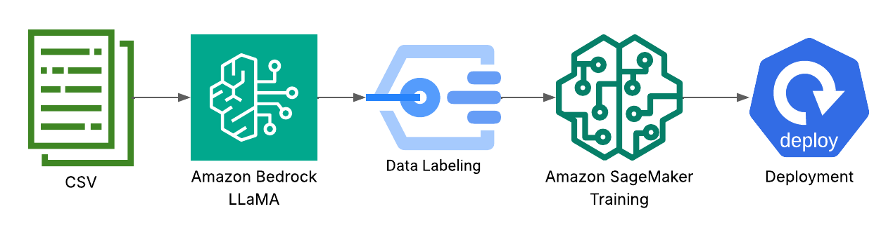

# Fraud Detection in Banking Transactions using LLaMA and AWS



This project implements an inference pipeline for credit risk assessment using AWS Bedrock and Amazon SageMaker.

## Description

The system processes credit applicant data, enriches the information by generating risk profile descriptions using a language model (Llama 3 on AWS Bedrock), and predicts the risk probability (good or bad) using an XGBoost model deployed on SageMaker.

## Features

- **Data Preprocessing**: Data cleaning and transformation, including One-Hot encoding for categorical variables.
- **AI-Powered Description Generation**: Uses AWS Bedrock (Llama 3) to generate textual risk profile descriptions based on customer attributes.
- **Risk Inference**: Credit risk classification using a SageMaker endpoint.
- **Evaluation Metrics**: Automatic calculation of Accuracy, Precision, Recall, F1-Score, and AUC-ROC.

## Results

The model achieved the following performance metrics:

- **Accuracy**: 0.72
- **Precision**: 0.77
- **Recall**: 0.81
- **F1-Score**: 0.79
- **AUC-ROC**: 0.74

**Confusion Matrix**:
```
[[ 40  31]
 [ 25 104]]
```

## Prerequisites

- Python 3.8 or higher
- AWS Account with permissions to access Bedrock and SageMaker.
- AWS Credentials configured locally (e.g., in `~/.aws/credentials` or environment variables).

## Installation

1. Clone this repository:
   ```bash
   git clone https://github.com/rodrigourquizo/challenge-ai
   ```

2. Install dependencies:
   ```bash
   pip install -r requirements.txt
   ```

## Configuration

The `src/config.py` file contains the main configurations. Ensure the values match your AWS environment:

- `AWS_REGION`: AWS Region (e.g., 'us-east-1').
- `BEDROCK_MODEL_ID`: Bedrock Model ID (e.g., Llama 3).
- `SAGEMAKER_ENDPOINT_NAME`: Deployed SageMaker endpoint name.

## Usage

To run inference on a data file (Excel or CSV):

```bash
python src/inference.py
```

## Project Structure

- `src/`: Source code.
  - `inference.py`: Main inference script.
  - `processing.py`: Preprocessing and description generation logic.
  - `config.py`: Configuration variables.
- `data/`: Data directory.
  - `raw/`: Original data.
  - `processed/`: Processed data (if applicable).
- `notebooks/`: Jupyter notebooks for exploration and testing.
- `tests/`: Unit tests.
- `requirements.txt`: List of dependencies.
